# 개발상식, 기타

## 1. 가상화가 무엇이고, 이것이 가상머신과 어떠한 차이가 있는지 설명해 주세요.
가상화는 물리적인 자원을 논리적으로 구분해 여러 가상 자원으로 나누는 기술을 의미하며, 그 예로 CPU 가상화, 메모리 가상화, 스토리지 가상화 등이 있다.      
가상머신은 가상화 기술로 만들어진 결과물로서, 하나의 물리적 서버에서 동작하는 독립적인 실행환경, 실제 컴퓨터처럼 동작하는 논리적인 머신을 의미한다. 

#### 가상화
- 컴퓨터나 네트워크의 자원을 논리적으로 구분하여 하나의 물리적 자원을 여러 개의 가상 자원으로 나누어 사용하는 기술
- 하나의 물리적 자원을 여러 개의 논리적 자원처럼 보이도록 추상화하는 기술
- 예시
  - 하나의 물리 서버가 여러 개의 독립적인 서버처럼 동작
  - 하나의 물리 저장 장치가 여러 개의 논리 드라이브로 분리
  - 하나의 CPU는 여러 프로세스가 동시에 돌 수 있도록 분리된 것처럼 보여줌
- 장점
  - 자원의 효율적인 사용 (자본 및 운영 비용 절감)
  - 다운타임(=서비스가 중단되는 시간) 최소화 (하드웨어에 의존하지 않기 때문에 가상화 환경에서는 물리 서버에 장애가 나거나 점검을 하더라도 VM을 다른 곳으로 옮기기만 하면 됨)
  - 독립적 실행 환경 격리 (보안 및 안정성 증가)
  - 관리/배포 편의성 (스냅샷, 복제 등)

#### 가상머신 (Virtual Machine, VM)
> 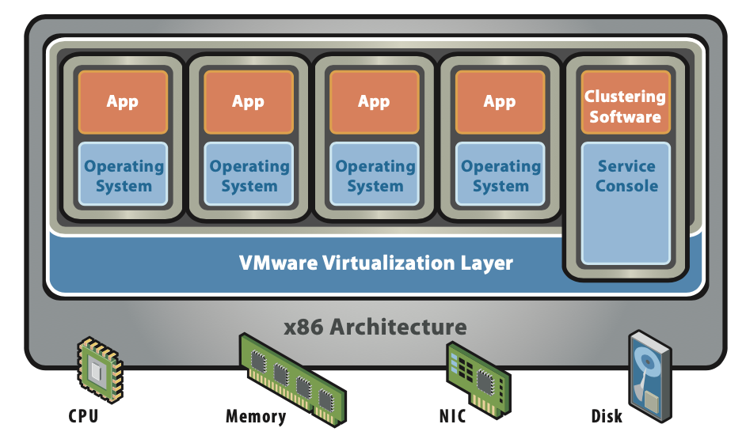
- 하드웨어 가상화 기술을 이용해 하나의 물리적 서버에서 여러 개의 가상 서버를 구축하는 기술 중 하나
- 물리적 하드웨어 시스템에 구축되어 자체 CPU, 메모리, 네트워크 인터페이스 및 스토리지를 갖추고 가상 컴퓨터 시스템으로 작동하는 가상 환경
- 물리적인 컴퓨터 상에 소프트웨어를 이용해 논리적으로 만든 컴퓨터
- 분할된 가상머신들은 서로 독립적으로 동작하며 각각의 가상 머신은 하나의 물리적 서버처럼 동작
- 하이퍼바이저(Hypervisor)라는 소프트웨어를 이용해 물리적 자원을 가상 자원으로 분할하고 각각의 가상 자원에 운영체제와 애플리케이션을 설치해 실행 가능
  > ##### 하이퍼바이저
  > - 가상화 계층을 구현해주는 소프트웨어.
  > - 하드웨어 위에서 가상 머신을 생성하고, 자원을 할당하고, 가상 머신들의 요청을 처리하고, 삭제 처리까지를 도와주는 역할 수행. 가상 머신이 동작하는 모든 환경을 관리하기 때문에 가상 머신 매니저라고도 부름
  > - 물리 하드웨어와 가상 머신의 영역을 분리하고 그 사이에서 중간 관리자, 인터페이스 역할을 함
  > - 유형 1 하이퍼바이저와 유형 2 하이퍼바이저로 구분됨
  >   - 
  >   - 유형 1 하이퍼바이저에는 호스트 OS가 따로 존재하지 않으며, 하이퍼바이저가 하드웨어 위에서 직접 구동되어 게스트 OS 관리. VM들을 관리하기 위해 별도의 컴퓨터나 콘솔이 필요함
  >   - 
  >   - 하드웨어에 호스트OS가 미리 설치되어 있으며, 하이퍼바이저는 OS 위에서 소프트웨어로서 동작함. 호스트OS의 문제가 전체 게스트OS에 영향을 줄 수 있음
  > - 가상 서버를 만들어달라는 요청을 하이퍼바이저에게 전달하면 하이퍼바이저는 새로운 가상 서버를 생성하고, 물리 서버가 가진 컴퓨팅 리소스(CPU, 메모리, 스토리지, 네트워크)를 각 가상 서버에게 할당하고, 각 서버에 필요한 운영체제를 설치해줌
  
### 그렇다면 Docker는 둘 중 어디에 속하나요? 왜 사람들이 Docker를 많이 채택할까요?
Docker는 OS 레벨의 커널 기반 가상화 기술로, 전자에는 속하지만 하드웨어 수준의 하이퍼바이저 기반 가상화 기술인 가상 머신에는 속하지 않는다.

#### Docker 
> 
- 컨테이너화를 사용하여 응용 프로그램의 배포, 확장 및 관리를 자동화할 수 있는 오픈 소스 플랫폼
  > - 컨테이너화
  >   - 응용 프로그램을 실행하는 데 필요한 모든 것을 포함하며 가볍고 격리된 환경을 제공.
  >   - 코드, 실행시간, 시스템 도구 및 라이브러리 등을 포함하여 응용 프로그램과 해당 종속성을 표준화된 단위로 패키징하여 일관되게 배포하고 실행하는 것이 컨테이너화의 목적.
- 아키텍처
  - Client : Docker 명령어를 사용해 컨테이너를 실행, 관리, 모니터링하고 이미지를 빌드하거나 다운로드할 수 있음. Docker 명령어를 통해 Docker Host와 상호작용
  - Host : Docker 컨테이너를 실행하는 데 사용되는 가상머신을 의미하며 Docker 데몬을 실행하여 컨테이너를 생성, 시작, 중지 및 관리를 수행. 호스트 운영체제의 리소스를 사용하여 컨테이너를 실행하고 관리함
  - Registry : Docker 이미지를 저장하고 관리하는 중앙 집중식 저장소. 공식적인 레지스트리는 Docker Hub이며 개인이나 기업이 독립적인 레지스트리를 구축 가능 
- 구성요소
  - 도커 데몬(Docker Daemon) : 클라이언트에서 요청한 도커 명령어를 처리하고 도커 컨테이너를 관리하는 백그라운드 프로세스. 도커 엔진과 상호작용하여 컨테이너의 생성, 실행, 중단, 삭제 등을 처리. 컨테이너의 생명 주기를 관리하고 리소스 할당, 네트워크 연결 등의 작업 처리
  - 도커 이미지 : 도커 컨테이너를 실행하기 위한 파일과 설정 정보를 포함하는 컨테이너의 템플릿. 이미지는 `Dockerfile` 이라는 텍스트 파일에 정의되며 도커 이미지를 생성하는 데 사용된다. 
    - Dockerfile : 도커 이미지를 만들고 빌드하기 위한 텍스트 파일. 컨테이너 이미지를 구성하는 데 필요한 모든 단계와 명령 정의. 일련의 명령을 작성해 이미지를 빌드하는 방법을 지정한다. 
  - 도커 컨테이너 : 실행 가능한 이미지 인스턴스. 컨테이너 간의 격리된 환경에서 실행되며 호스트와 독립적으로 실행된다.

#### Docker와 가상머신의 차이점 및 채택하는 이유
> 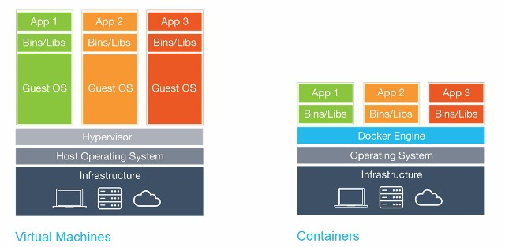
- VM은 하이퍼바이저 위에 게스트OS가 깔리지만, 도커의 컨테이너에는 게스트OS가 설치되지 않는다. 
  - → VM은 하나씩 추가될 때마다 OS를 위한 자원을 할당해주어야 하는 반면 도커는 애플리케이션을 구동하는 데 필요한 패키지만 있으면 컨테이너를 구동시킬 수 있다.
  - → VM은 게스트OS가 필요하므로 무겁고 부팅이 느리지만 도커의 컨테이너 실행시간은 0.1~1초 사이로 가볍고 빠르다. 따라서 개발/배포 속도가 매우 빨라진다.
  - → 동일한 서버에서 VM을 3-4개 돌릴 자원으로 Docker Container는 수십~수백 개를 돌리는 것이 가능하다. 클라우드 비용 절감 효과가 크다.
- 도커의 컨테이너는 호스트OS의 **커널을 공유하는 방식**으로 동작하며, 하나의 커널을 공유하고 있기 때문에 호스트 시스템에서 컨테이너 내부의 프로세스를 볼 수 있다.
- 개발환경을 컨테이너로 추상화하여 개발자들이 동일한 환경에서 일관되게 작업할 수 있도록 지원
- 컨테이너는 격리된 환경에서 실행되어 독립적으로 동작하기 때문에 응용 프로그램의 안정성과 보안성을 향상시킴
- 가상화의 목적이 완전한 격리와 다양한 OS의 실행이라면 VM이, 애플리케이션의 패키징/배포/확장에 초점을 둔다면 도커가 적합

|구분|가상머신(VM)|Docker 컨테이너|
|---|----------|-------------|
|분류|하드웨어 가상화|OS 레벨 가상화|
|게스트 OS|필요|필요X|
|실행 속도|느림(수십 초)|빠름(0.1~1초)|
|자원 사용량|높음|낮음|
|격리 방식|하이퍼바이저|커널 기반 격리|
|포함 여부|가상화 기술의 한 형태|가상화 기술의 또 다른 형태|

### 하나의 Host OS에서 돌아간다면 충분히 한 컨테이너가 다른 컨테이너에 간섭할 수 있는 위험이 있지 않을까요? 이를 어떻게 방어할 수 있을까요?
리눅스 커널의 Cgroup(control groups)과 네임스페이스 기능을 이용해 구현되어있다.
  
#### Namespaces
- 리눅스 커널의 네임스페이스는 커널 자원(PID, MNT, NET, cgroup, ...)을 분할해 프로세스마다 격리된 시스템 환경을 제공하는 기능
- 네임스페이스로 컨테이너 내부의 프로세스가 호스트 시스템이나 다른 컨테이너 자원에 접근하지 못하도록 논리적 경계를 설정
- 주요 네임스페이스 종류
  - 마운트(`mnt`) : 독립적인 파일 시스템 환경을 위한 마운트 지점 격리 → 같은 컴퓨터이지만 각 컨테이너가 모두 서로 다른 파일시스템을 보고 있는 것처럼 해줌
  - 프로세스 ID(`pid`) : 컨테이너 내부의 프로세스를 독립적으로 관리하기 위한 PID 공간 분리
  - 네트워크(`net`) : IP 주소와 포트 등 독립적인 네트워크 스택 제공 → 컨테이너마다 NIC와 IP가 각자 따로 존재하는 것처럼 보이도록 함
  - IPC(Inter-Process Communication) : 프로세스 간 통신(IPC) 자원의 격리
  - UTS(Unix Time-Sharing system) : 호스트 이름과 도메인 이름의 격리
  - 사용자(`user`) : 사용자와 그룹 ID의 격리, 호스트 시스템에서 root 권한 제한 → 컨테이너 안에서 root인 사용자이더라도 host에서는 root가 아닐 수 있음
  - cgroup : 자원 제어 그룹 계층 구조 격리
  - 타임(`time`) : 시스템 시간을 독립적으로 설정하도록 지원

#### cgroups (Control Groups)
- CPU, 메모리, I/O 프로세스 수 등을 컨테이너 별로 제한. 자원 사용량 측면에서의 격리
- 한 컨테이너에 문제가 생겨도(ex.OOM;OutOfMemory) 다른 컨테이너에 영향이 가지 않도록 함

### Docker 위에 Docker를 올릴 순 없을까요?
- 크게 두 가지 방법을 이용해 Docker 위에 Docker를 띄울 수 있다. 
  - DinD
  - DooD
- Jenkins와 같은 CI/CD 도구를 사용할 때, Jenkins 자체가 도커 컨테이너로 실행되고 있고 빌드 단계 중 도커 명령(ex. 이미지 빌드)이 필요한 경우 사용

#### 1. Docker-in-Docker (DinD) | 컨테이너 안에 Docker 데몬을 띄우기
> 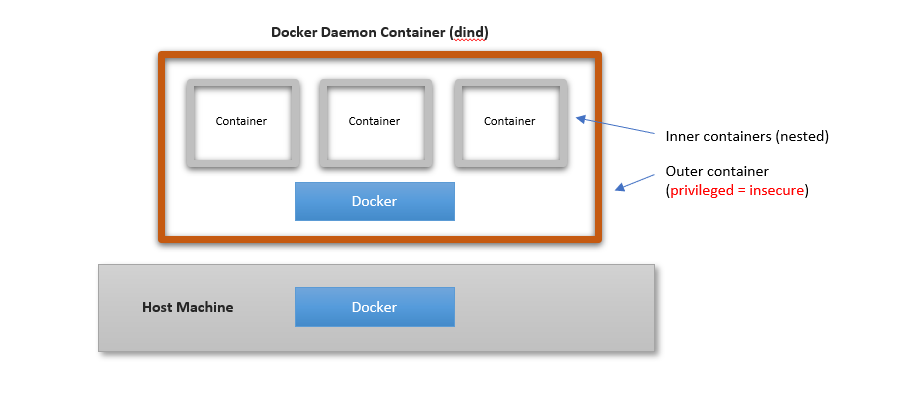
- 도커 컨테이너 내부에 호스트 도커와는 별개의 새로운 도커를 실행시키기
- 바깥 컨테이너가 `docker build`, `docker pull` 같은 클라이언트의 역할과 도커 데몬의 역할을 동시에 수행
- CI/CD 테스트 환경을 독립적으로 만들 때 유용
- 기술적 결함이 존재하기 때문에 권장 X → Docker 데몬은 원래 호스트에서 root 권한으로 동작하므로 컨테이너 내부에서 데몬을 띄우려면 그 컨테이너도 root + previleged 권한을 갖게 되고, 결국 호스트 입장에서 보면 컨테이너가 호스트 수준의 권한을 가지는 것이므로 위험

#### 2. Docker-outside-of-Docker(DooD) | 호스트의 Docker Engine을 공유하기
> 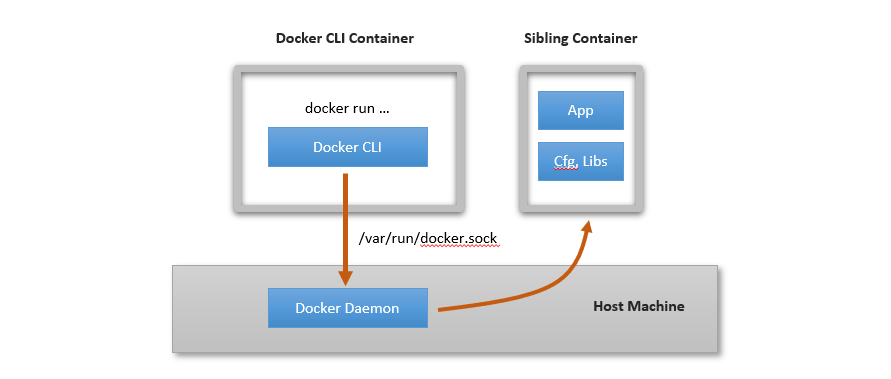
- 호스트 도커에 컨테이너들을 병렬로 띄우는 방법. 인스턴스가 서로 독립적이지 않지만 DinD의 문제를 우회 가능
- 호스트 도커 데몬이 사용하는 소켓을 공유하여 컨테이너를 실행시키기 (→ 현재 컨테이너와 동등한 위치에 있는 형제 컨테이너를 실행시키는 것)
- 컨테이너가 호스트의 도커 데몬과 직접 통신, 컨테이너 내부에서 docker build를 실행하면 실제로는 호스트에서 컨테이너가 만들어지는 방식
- CI/CD 도구에서 표준 방식이며 보안 리스크가 DinD보다 훨씬 낮다.
- 가볍고 빠름

## 2. CI/CD 를 사용해 본 경험이 있나요? 있다면 간단하게 설명해 주세요.

## 3. (JAVA에서) static 키워드는 어떤 의미를 갖나요? (본인이 사용하는 언어에서 없다면 패스...)
- 어떤 객체에 속하는 것이 아닌 클래스에 속하는 멤버를 정의할 때 사용하는 키워드로, 인스턴스를 생성하지 않고도 접근할 수 있으며 클래스 내의 모든 인스턴스가 공유하는 속성이나 메서드를 정의할 때 유용하다. 
- 클래스 레벨에서 사용되며, 클래스가 로드될 때 단 한번만 메모리에 할당되고 프로그램이 종료될 때까지 유지된다.
- static 메서드는 인스턴스 생성 없이 호출될 수 있으므로 인스턴스 변수에 접근하는 것은 불가능하고 오직 static 변수나 static 메서드에만 접근 가능하다.
- (-) 모든 인스턴스에서 공유되기 때문에 하나의 인스턴스에서 static 변수의 값을 변경할 시 모든 인스턴스에 영향을 미치게 된다. 

### 컴파일 할 때, static 키워드가 붙은 변수, 함수는 어떻게 처리되나요?
1. 컴파일 단계
- 자바 컴파일러(javac)는 static이 붙은 멤버를 보면
  - static 변수의 경우 class 파일의 필드 테이블에 static 플래그 설정
  - static 메서드의 경우 class 파일의 메서드 테이블에 static 플래그 설정
  - 인스턴스 멤버와 static 멤버를 구분하는 메타데이터 기록
  - static 초기화 코드(static{ })를 <clinit> 메서드로 합침
    > ##### static 초기화 블록
    > - 선언된 클래스가 JVM에 처음 로딩될 때 단 한번 실행되는 블록 
    > - 클래스 레벨에서 실행되는 코드로 주로 정적 필드를 초기화하는 데 사용
    > - 한 클래스에 여러 개의 static 초기화 블록을 선언할 수 있고 위에서부터 순서대로 실행됨
    > ```java
    > class Clazz {
    >   static Map<String, Integer> staticMap;
    > 
    >   static {
    >       staticMap = new HashMap<>(); 
    >       staticMap.put("value1", 1);
    >       staticMap.put("value2", 2);
    >   }
    > 
    >  //여러 개 선언 가능
    >   static {
    >       ...
    >   }
    > ...
    > }
    > ```
2. 클래스 로딩 단계
- 클래스 파일을 읽어 JVM 메모리에 적재
- static 멤버를 JVM의 Method Area에 배치
- static 초기화 블록 실행 (<clinit> 메서드)
3. 런타임
- static 멤버를 사용할 때는 객체와 상관 없이 참조 → 인스턴스 메모리(Heap)가 아니라 Method Area의 static 영역을 참조


> ##### `<clinit>`과 `<init>`
> - JVM이 클래스와 객체를 초기화하기 위해 자동으로 생성/실행하는 특수한 메서드
> - `<clinit>` : 클래스 레벨 초기화 메서드 (static 초기화)
>   - JVM이 클래스 로딩 시 단 한번 자동으로 생성하고 실행하는 메서드
>   - static 멤버 초기화를 위해 실행됨
> - `<init>` : 인스턴스 초기화 메서드
>   - 자바에서 생성자를 선언하면 컴파일러가 <init>이라는 JVM용 메서드로 바꿔서 기록
>   - 객체가 생성될 때마다 실행됨
>   - 클래스마다 여러 개 존재할 수 있음

### Java에서 static과 static final은 어떤 차이를 갖나요? final과 static final은요? 
- static : 클래스 수준에서 하나만 존재하며 모든 인스턴스가 공유하는 멤버
  - 클래스 로딩 시 Method Area에 저장
  - 인스턴스 생성 없이 사용 가능
  - 값 변경 가능
  - 모든 객체가 같은 값을 공유
- final : 한번 초기화되면 값(또는 참조)를 변경할 수 없는 멤버
  - 불변성 제공
  - 인스턴스 멤버일 수도 있고 지역 변수일 수도 있음 (모든 객체가 같은 값을 공유하지 X)
  - 반드시 한번만 초기화 가능
- static final : 클래스 수준에서 하나만 존재하며 변경 불가능한 상수
  - 클래스 로딩 시 단 한번만 메모리에 올라감
  - 모든 인스턴스가 공유
  - 값 변경 불가
  - 상수 정의 시 사용
  - 컴파일 타임 상수로 처리될 수도 있음 (= 해당 값이 런타임이 아닌 컴파일 타임에 결정되고, JVM은 그 값이 저장된 메모리 주소를 참조하는 것이 아니라 컴파일러가 그 값을 그대로 코드에 박아넣는다는 의미)

## 4. 객체지향 프로그래밍이 무엇인가요?
- 프로그램에서 필요한 데이터를 추상화시켜 상태와 행위를 가진 객체로 만들고, 객체들 간의 상호작용을 통해 로직을 구성하는 프로그래밍 방법론
- 유지보수성과 재사용 ↑ b.c. 모듈화, 캡슐화
- 상대적으로 속도가 느리고 메모리를 많이 사용하는 경향이 있음
- 객체지향프로그래밍의 4가지 특징
  - 추상화 : 불필요한 세부사항을 제거하고 객체의 공통적인 속성과 기능들을 추출하여 정의하는 것 (추상클래스/인터페이스)
  - 캡슐화 : 클래스 안에 서로 연관있는 속성과 기능들을 하나의 캡슐로 만들어 데이터를 외부로부터 보호하는 것 → 데이터 보호/데이터 은닉을 위함
    - 데이터 보호 : 외부로부터 클래스에 정의된 속성과 기능을 보호
    - 데이터 은닉 : 내부의 동작을 감추고 외부에는 필요한 부분만 노출
  - 상속 : 클래스 간 공유될 수 있는 속성과 기능들을 상위 클래스로 추상화시켜 해당 클래스를 상속받는 하위 클래스들이 상위 클래스의 속성과 기능들을 간편히 사용 가능하도록 함
  - 다형성 : 어떤 객체의 속성이나 기능이 상황에 따라 여러가지 형태를 가질 수 있는 성질 (오버로딩/오버라이딩)

### SOLID 원칙에 대해 설명해 주세요.
SOLID 원칙은 객체지향 설계에서 지켜줘야 할 5개의 소프트웨어 개발 원칙으로 내용은 다음과 같다.

1. 단일 책임 원칙 (Single Responsibility Principle)
> - 클래스(객체)는 단 하나의 책임만 가져야 한다는 원칙
> - 프로그램의 유지보수성을 높이기 위한 설계 기법
2. 개방 폐쇄 원칙 (Open Closed Principle)
> - 클래스는 확장에 열려있고 수정에 닫혀있어야 한다는 원칙
> - 새로운 변경사항이 발생했을 때 기존 코드를 수정하지 않고 기존 구조를 확장하는 방식으로 구현해야 한다
> - 추상화 사용을 통한 관계 구축을 권장한다는 의미
3. 리스코프 치환 원칙 (Liskov Substitution Principle)
> - 서브 타입은 언제나 기반(부모) 타입으로 교체할 수 있어야 한다는 원칙
> - 다형성의 특징을 이용하기 위해 상위 클래스 타입으로 객체를 선언하여 하위 클래스의 인스턴스를 받으면 업캐스팅된 상태에서 부모의 메서드를 사용해도 동작이 의도대로 흘러가야함을 의미
4. 인터페이스 분리 원칙 (Interface Segregation Principle)
> - 인터페이스를 각각 사용에 맞게끔 잘 분리해야한다는 원칙
> - SRP가 클래스의 단일 책임을 강조한다면 ISP는 인터페이스의 단일 책임을 강조
5. 의존 역전 원칙 (Dependency Inversion Principle)
> - 어떤 클래스를 참조해서 사용해야 하는 상황이 온다면, 그 클래스를 직접 참조하는 것이 아니라 그 대상의 상위 요소(추상 클래스 또는 인터페이스)로 참조하라는 원칙
> - 구현 클래스에 의존하지 말고 인터페이스에 의존하라는 의미 → 클래스 간의 결합도를 낮추기 위함 
> - 의존 관계를 맺을 때 변화하기 쉬운 것보다는 변화하기 어려운 것에 의존하라는 의미 

> ##### 참조형 캐스팅 (업캐스팅 / 다운캐스팅)
> - 캐스팅 : 하나의 데이터 타입을 다른 타입으로 바꾸는 것을 타입 변환 또는 형변환(캐스팅)이라고 한다.
>   - 자바의 데이터형은 크게 기본형(primitive)과 참조형(reference)로 나뉘게 되며, 서로 타입 간의 형변환이 가능하다.
> - 상속 관계의 클래스는 부모 클래스와 자식 클래스로 구분되며, 서로 간의 형변환이 가능하다. 클래스는 참조형 타입으로 분류되니 이를 참조형 캐스팅이라고 부른다.
> 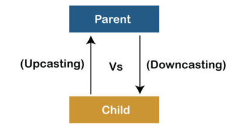
> - 업캐스팅 : 자식 클래스가 부모 클래스 타입으로 캐스팅되는 것
>   - 부모 클래스로 캐스팅된다는 것은 멤버의 개수 감소를 의미
>   - 자식 클래스에만 있는 속성과 메서드는 실행하지 못한다는 의미
>   - 업캐스팅 후 메서드를 실행할 때 자식 클래스에서 오버라이딩한 메서드가 존재할 경우 부모 클래스의 메서드가 아닌 오버라이딩된 메서드가 실행됨
>   - 공통적으로 할 수 있는 부분을 만들어 간단하게 다루기 위해서 사용. 상속 관계에서 서브 클래스가 몇 개이든 하나의 인스턴스로 묶어 관리 가능 (ex. `Rectangle`과 Triangle`과 `Circle`을 `Shape[]` 로 묶어서 관리 가능)
> - 다운캐스팅 : 부모 클래스가 자식 클래스의 타입으로 캐스팅되는 것
>   - 캐스팅 연산자 괄호를 생략할 수 없음
>   - 업캐스팅한 객체를 다시 자식 클래스 타입의 객체로 되돌리는 것이 목적 (=원래 있던 기능을 회복하기 위함)
>   - 업캐스팅된 부모 객체가 아닌 오리지날 부모 객체에 다운캐스팅 연산자를 사용할 경우 런타임에 에러 발생
> - `instanceof` 연산자
>   - 참조 캐스팅을 잘못하면 런타임 환경에서 에러 발생 → instanceof 연산자를 통해 업캐스팅/다운캐스팅 유무를 확인 후 참조 캐스팅 동작 결정
>   - 어느 객체 변수가 어느 클래스 타입인지 판별해 true/false 를 반환해줌
>   - 객체에 대한 클래스 타입에만 사용 가능 (참조형이 아닌 기본형 타입에 사용 불가)

### 다형성이 무엇인지 설명하고, 동적 다형성과 정적 다형성이 무엇인지 설명해 주세요.

#### 다형성 (Polymorphism)
- 동일한 인터페이스를 사용하여 객체가 여러 형태로 동작할 수 있도록 하는 객체지향 프로그래밍의 핵심 개념 → 무엇을 호출하는지는 동일하지만 어떻게 동작할지는 객체에 따라 달라짐
- 다형성 활용 시 코드 재사용성과 확장성이 높아짐
- (JAVA) 상속과 인터페이스를 기반으로 구현
- 다형성은 크게 정적 다형성과 동적 다형성으로 나뉨

#### 정적 다형성
- 컴파일 시점에 호출할 메서드가 결정되는 다형성
- 주로 메서드 오버로딩을 통해 구현됨
- 메서드 시그니처(매개변수 타입/개수)에 따라 결정
- 예시 : 어떤 `add()`를 호출할지 컴파일 시점에 확정됨
  ```java
  class Calculator {
    int add(int a, int b) {
        return a + b;
    }
  
    double add(double a, double b) {
        return a + b;
    }
  }
  
  Calculator calc = new Calculator();
  calc.add(1, 2);
  calc.add(0,1, 0.2);
  ```

#### 동적 다형성
- 실행 시점(런타임)에 어떤 메서드가 호출될지 결정되는 다형성
- 주로 메서드 오버라이딩을 통해 구현됨
- 객체의 실제 타입을 기준으로 메서드가 바인딩됨
- 예시 : 컴파일 시점에는 `Animal.sound()`의 존재 여부만 확인하지만 실행 시점에는 `Dog.sound()` 호출
  ```java
  class Animal {
    void sound() {
        System.out.println("동물 소리");
    }
  }
  
  class Dog extends Animal {
   @Override
   void sound() {
       System.out.println("멍멍");
   }
  }
  ```

> ##### 정적 바인딩
> 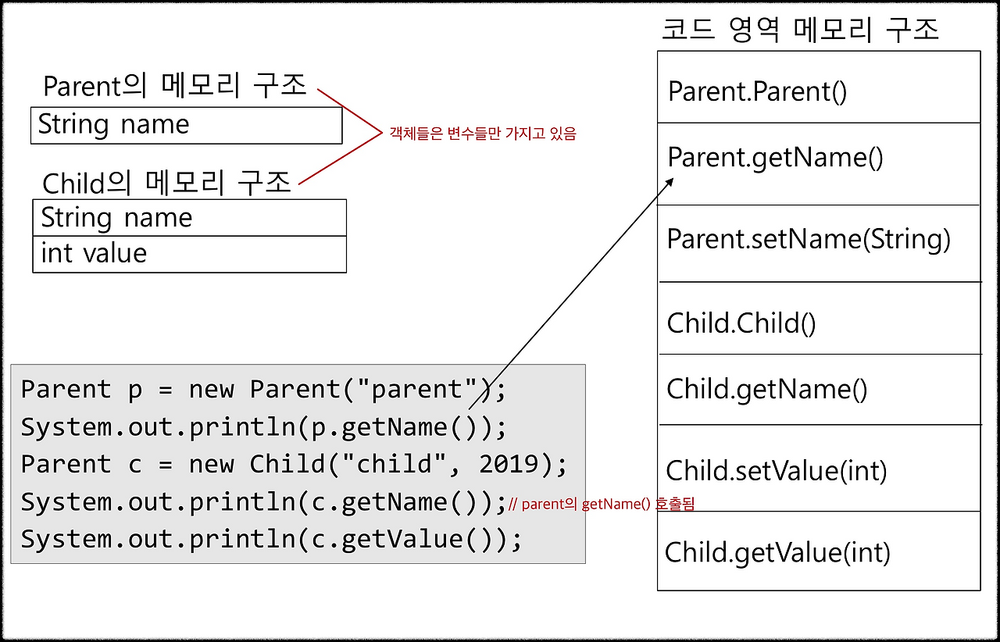
> - 각 객체(인스턴스)들은 필드(상태)만 보유하고 메서드 주소를 객체마다 들고 있을 필요 X
> - 이미 결정된 주소로 가서 함수를 단순히 실행 시키면 되므로 오버헤드가 적음
> ##### 동적 바인딩
> 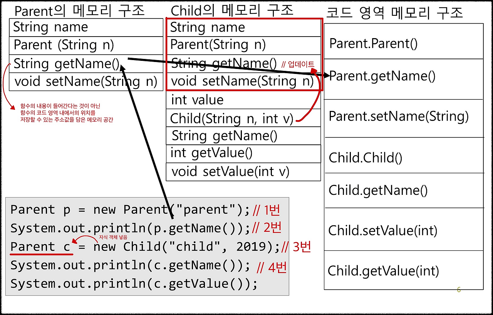
> - 객체가 메서드의 내용을 들고 있지는 않지만 메서드가 정의된 코드 영역의 위치를 찾을 수 있는 참조를 보유 (메서드 코드는 클래스 단위로 코드 영역에 존재함)
> - `Child`는 `Parent`를 상속하므로 `Parent`의 인스턴스 필드와 자신의 필드를 함께 가짐
> - 1번 코드 : Heap에 `Parent` 객체가 생성되고, 객체는 Parent 클래스의 메타데이터를 가짐
> - 3번 코드 : Heap에 `Child` 객체가 생성되고, 참조 변수 `c`는 Parent 타입이지만 Child 객체를 가리킴
> - 4번 코드 : 컴파일 타임에는 Parent 타입에 `getName()` 메서드가 존재하는지만 확인하고, 런타임에는 실제 객체 타입인 Child에 맞춰 `Child.getName()`을 선택함
>   - 런타임 디스패치의 흐름 : 객체 참조 → 실제 객체 → 클래스 메타데이터 → 메서드 테이블(vtable) → 실제 실행 메서드


### 오버로딩과 오버라이딩의 차이에 대해 설명해 주세요.
| 구분           |오버로딩|오버라이딩|
|--------------|-----|--------|
| 정의           |같은 이름의 메서드를 매개변수의 목록이 다르게 여러개 정의하는 것|부모 클래스의 메서드를 자식 클래스에서 동일한 시그니처로 재정의하는 것|
| 매개변수         |달라야 함|동일|
| 반환타입         |상관없음|동일|
| 발생위치         |동일 클래스|상속 관계의 두 클래스|
| 호출 대상의 결정 시점 |컴파일 타임|런타임|
| 다형성          |정적 다형성|동적 다형성|

> ##### 가상함수
> - 런타임에 실제 객체의 타입을 보고 어떤 메서드가 호출될 것인지 결정되는 함수
> - 호출 대상이 컴파일 타임에 확정되지 않고 런타임 디스패치를 통해 결정되는 함수
> ##### vtable
> 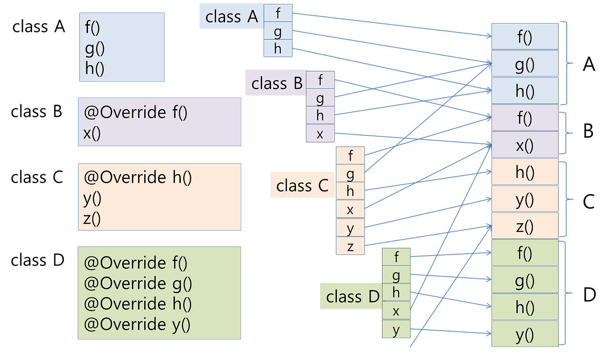
> - 이미지 설명
>   - 왼쪽 박스는 각 클래스에 정의된 함수 코드
>   - 가운데 박스는 클래스별 vtable
>   - 오른쪽 박스는 바이트 코드로 컴파일된 함수의 코드 부분
> - 객체의 메서드가 호출되면, 각 객체의 헤더에는 해당 클래스의 메타데이터를 가리키는 포인터를 존재하고, 그 클래스 메타데이터 안에는 vtable이 존재. 거기서 해당 메서드가 가리키는 코드 부분을 실행(=함수의 시작 명령문 주소로 점프)하게 되는 것

### 클래스가 있는 언어는 반드시 객체지향 언어라고 할 수 있을까요? 그 반대는 성립하나요?
1. 클래스가 있다고 반드시 객체지향 언어는 아니다.
  > 클래스는 구현 수단일 뿐, 객체지향의 본질은 객체 간 상호작용과 다형성, 캡슐화 등에 있음. (객체지향의 4가지 특징)
2. 객체지향 언어라고 해서 반드시 클래스 기반일 필요는 없다.
  > JavaScript는 클래스 기반이 아닌 프로토타입 기반 언어이지만 객체지향 언어이다.

## 5. 프레임워크와 라이브러리의 차이에 대해 설명해 주세요.
#### 프레임워크
- 애플리케이션 개발 시 필수적인 코드, 알고리즘, DB 커넥션 등의 기능들을 위해 뼈대(구조) 제공
- 개발자는 이러한 뼈대 위에서 코드를 작성해 원하는 애플리케이션 개발
- 앱/서버의 구동, 메모리 관리, 이벤트 루프 등 공통 부분은 프레임워크가 관리하고 사용자는 프레임워크가 정해준 방식대로 클래스, 메소드 구현
- **제어의 역전**이 발생, 프레임워크가 흐름을 주도함. 예를 들어 아래 코드에서 `getMembers()` 메서드의 호출 주체와 제어는 프레임워크임 (요청이 오면 프레임워크가 호출함)
  ```java
  @RestController
  public class MemberController {
  
      @GetMapping("/members")
      public List<Member> getMembers() {
          return memberService.findAll();
      }
  }
  ```
- 예시 : Spring, Django, Flask, Android, Vue.js 등

#### 라이브러리
- 소프트웨어를 개발할 때 컴퓨터 프로그램이 사용하는 비휘발성 자원의 모임
- 미리 작성한 코드, 변수, 함수, 클래스가 포함됨
- 재사용이 가능한 기능을 미리 구현해놓고 필요한 곳에서 호출해 사용가능하도록 만들어진 집합
- 제어 흐름을 개발자가 직접 관리함
- 예시 : Python의 pip로 설치한 패키지/모듈, C++의 표준 템플릿 라이브러리(STL), Node.js에서 npm으로 설치한 모듈 등

#### 프레임워크 vs 라이브러리
- 가장 중요한 차이점은 **"제어 흐름"의 권한이 어디있는가**
- 프레임워크에서는 제어의 역전이 발생하며, 프레임워크에게 제어 흐름을 넘김으로써 개발자는 필요한 기능을 구현하는 데 집중할 수 있음
- 라이브러리는 사용자가 직접 전체적인 코드의 흐름을 제어하고, 필요에 따라 라이브러리를 호출해 사용하는 것

## 6. Call By Value와 Call By Reference의 차이를 본인의 언어를 기반으로 설명해 주세요.
- JAVA는 기본 타입과 객체 타입 모두 Call By Value 방식만 지원한다.
  - 기본 타입은 값 자체가 복사됨
  - 객체 타입은 객체를 가리키는 참조값이 복사되기 때문에 객체 내부 상태는 변경될 수 있지만, 변수 자체를 변경하는 Call By Reference 방식은 지원 X

#### Call By Value
- 함수 호출 시 인자의 값이 복사되어 전달되는 방식
- 원본 변수와 매개변수는 서로 다른 공간
- 함수 내부에서 값을 변경해도 원본에 영향 X
- Java의 기본 타입(Primitive Type)
  ```java
  void change(int x) {
  x = 10;
  }
  
  int a = 5;
  change(a);
  System.out.println(a); // 5
  ```
  - `a`의 값 5가 `x`로 복사됨
  - `x = 10`는 원본 `a`와 무관
- Java의 객체 타입(Reference Type)
  ```java
  class Box {
  int value;
  }
  
  void change(Box b) {
  b.value = 10;
  }
  
  Box box = new Box();
  box.value = 5;
  change(box);
  System.out.println(box.value); // 10
  ```
  - 전달되는 값은 객체 자체가 아니라 객체의 참조값
  - 참조값이 복사되고, 복사된 참조값이 같은 객체를 가리키기 때문에 값이 바뀌는 것 → Call By Value이지만 Call By Reference처럼 보이게 됨
    ```
    box ──┐
          ├──▶ Heap의 Box 객체
    b  ───┘
    ```

#### Call By Reference
- 함수에 인자를 전달할 때, 값이 아니라 변수 자체(메모리 주소)에 대한 참조가 전달되는 방식
- 매개변수는 호출한 쪽의 변수에 대한 별명(alias)
- 함수 내부에서 값을 변경하면 호출한 쪽의 변수에도 영향 O
- C++의 기본 타입
  ```C++
  void change(int& x) {
    x = 10;
  }
  
  int a = 5;
  change(a);
  std::cout << a; // 10
  ```
  - x는 a의 참조(reference)

### 사실 이 질문에는 약간의 낚시가 있습니다. 과연 모든 언어에 저 개념이 존재할까요?
- Call By Value와 Call By Reference는 일부 언어의 호출 방식을 설명하기 위한 개념 모델로, 모든 언어에 보편적으로 적용되는 개념은 X
- 실제로는 언어마다 전달되는 값의 의미와 변경 가능성이 달라 Python이나 Javascript처럼 별도의 호출 규칙을 가지는 경우도 존재
- `Call By...`라는 것은 평가 전략 중 하나로, 프로그래밍 언어에서 함수 호출 시 인자를 언제 평가하고 그 평가 결과를 어떤 방식으로 함수에 전달할지를 정의하는 규칙 (=함수에 인자로 뭘 던지느냐에 따라 함수가 어떻게 실행될지에 대한 방법을 결정짓는 것)
  - 평가 전략 : 함수 호출 시 인자를 언제, 어떤 방식으로 평가하고 그 결과를 함수에 어떻게 전달할지를 결정하는 언어의 규칙
  - 언제 평가하느냐 : eager / lazy
  - 무엇을 전달하느냐 : 값 / 참조 / 객체 공유 / 표현식 자체

## 7. 순수함수가 무엇인지를 함수형 프로그래밍 매커니즘과 연관지어 설명해 주세요.
#### 순수함수
- 부작용이 없는 함수, 즉 함수의 실행이 외부에 영향을 끼치지 않는 함수를 의미
- 순수함수의 두가지 특성
  > 1. 동일한 입력에 대해 항상 동일한 출력을 반환한다.
  > 2. 함수 외부의 상태를 변경하거나 의존하지 않는다. (부수 효과가 없다)
- 순수함수의 두가지 핵심 조건
  > 1. 참조 투명성 (Referential Transparency) 보장 : 어떤 표현식을 그 결과값으로 치환해도 프로그램의 의미나 동작이 변하지 않는 성질. 즉, `f(x) = 결과값`이 항상 성립하면 f(x)는 참조 투명하다.       
  >    [예시] `int x = add(2, 3) * add(2, 3);` 는 `int x = 5 * 5;` 와 의미상 완전히 동일하며, 결과값으로 치환해도 프로그램의 결과, 실행 흐름, 의미가 변하지 않으므로 `add(int a, int b)` 함수는 참조 투명하다.
  > 2. 부수 효과(Side Effects) 없음 : 전역 변수 조정, 객체 내부 상태 변경, I/O 수행, 시간/난수 등 외부 상태 의존 등의 행위가 존재하면 순수함수가 아님
- 순수함수의 장점
  - 예측 가능성 : 동일한 입력에 대해 항상 동일한 출력을 반환하므로 결과를 쉽게 예측 가능
  - 테스트 용이성 : 외부 의존성이 없기 때문에 단위 테스트가 쉬움
  - 병렬 처리 : 부수 효과가 없어 병렬 처리에 안전

#### 순수함수와 함수형 프로그래밍
- 함수형 프로그래밍이란 프로그램을 '상태 변화의 나열'이 아니라 '값을 계산하는 함수들의 조합'으로 바라보는 패러다임
  - 명령형 프로그래밍 : 프로그래밍의 상태와 상태를 변경시키는 구문의 관점에서 연산을 설명하는 프로그래밍 패러다임
- 자료 처리를 수학적 함수의 계산으로 취급하고 상태와 가변 데이터를 멀리하는 프로그래밍 패러다임
- 함수형 프로그래밍이 성립하기 위해서는 함수가 수학적 함수처럼 동작해야 함. 즉, 동일 입력에 대해 동일 출력을 반환하고, 부수 효과가 없어야 함. 이 조건을 만족하는 것이 순수 함수이므로 순수 함수는 함수형 프로그래밍의 핵심 조건인 것
- 순수함수의 부수효과가 없고 참조 투명성을 보장하는 특성은 불변성, 함수 합성, 고차 함수, 병렬 처리 등 함수형 프로그래밍의 핵심 메커니즘을 가능하게 하는 기반이 됨

### Side Effect가 무엇인가요? 이를 모두 없애는 프로그래밍이 이상적이라고 할 수 있을까요?
- 부수효과란 함수가 값을 반환하는 것 이외에 함수 외부의 상태나 관찰 가능한 환경을 변경하는 모든 행위를 일컬음
- 대표적인 부수효과 예시
  - 전역 변수 또는 외부 객체의 상태 변경
  - 파일 쓰기 / 네트워크 통신
  - 콘솔 출력
  - 예외 발생
  - 시간, 난수 등 외부 상태에 의존
- 부수효과의 문제점
  - 예측 가능성 저하 → 테스트와 디버깅이 어려움
  - 참조 투명성 붕괴 → 표현식을 결과값으로 치환 불가, 함수형 사고 불가능
  - 병렬성/동시성 문제 → 락, 동기화 필요
- 하지만 부수 효과를 완전히 제거한 프로그램은 현실 세계와 상호작용 불가. 현실 프로그램은 반드시 외부 세계와 상호작용 해야함.
  - 사용자 입력 처리
  - 화면 출력
  - 파일 저장
  - 네트워크 통신
  - DB 저장
- 부수 효과를 완전히 없애는 것이 아니라 부수효과를 격리하고 최소화하는 것이 최선의 선택

### 왜 함수형 프로그래밍 매커니즘을 사용한다고 생각하시나요?
- 함수형 프로그래밍 메커니즘은 프로그램의 예측 가능성을 높이고, 복잡한 상태 변화를 줄이며, 동시성 환경에서 안전한 코드를 작성하게 해주기 때문에 사용
- 적용 예시
  - 데이터 변환 : `map`, `filter`, `reduce`와 같은 고차함수를 사용해 컬렉션을 간결히 처리 가능
  - 선언적 코드로 의도 표현 : '어떻게'가 아닌 '무엇을' 할지 표현함으로써 문제해결에 대한 새로운 사고방식과 이해를 돕고, 가독성과 유지보수성을 향상시킴
    ```java
    list.stream()
        .filter(x -> x > 10)
    .map(x -> x * 2)
    .toList();
    ```

### 순수함수는 Thread Safe 한가요? 왜 그럴까요?
- Thread Safe : 멀티스레드 프로그래밍 환경에서 일반적으로 어떤 함수나 변수, 혹은 객체가 여러 스레드로부터 동시에 접근이 이루어져도 프로그램의 실행에 문제가 없는 상태 혹은 성질
- 순수함수는 외부 상태를 읽거나 쓰지 않고, 같은 입력에 대해 항상 같은 출력을 보장하며, 부수효과가 없다는 성질을 갖고 있다. 즉, 순수함수는 스레드 간 충돌 가능성이 없으므로 Thread Safe하다.

### 고차함수에 대해 설명해 주세요.
- 고차함수란, 함수를 파라미터로 전달받거나 연산의 결과로 반환해주는 메서드를 일컬음
- 함수를 인자로 받는 경우
  ```java
  list.stream()
    .filter(x -> x > 10)
    .map(x -> x * 2)
    .toList();
  ```
- 함수를 반환하는 경우
  ```java
  Function<Integer, Integer> multiplier(int n) {
    return x -> x * n;
  }
  
  Function<Integer, Integer> times2 = multiplier(2);
  System.out.println(times2.apply(5)); // 10
  ```
- 고차함수는 함수 합성, 파이프라인 처리, 비동기 흐름 구성, 불변성 유지 등을 가능케 하므로 함수형 프로그래밍의 핵심 도구
- 고차함수 자체가 순수할 필요는 없으나, 순수함수를 인자로 받으면 조합이 안전하고, 병렬 처리가 용이하며 예측 가능성이 증가한다.

## 8. MVC 패턴이 무엇인가요?
> 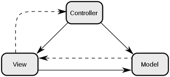
- 소프트웨어 디자인 패턴 중 하나로, 사용자 인터페이스로부터 비즈니스 로직을 분리하여 애플리케이션의 시각적 요소나 그 이면에서 실행되는 비즈니스 로직을 서로 영향 없이 쉽게 변경할 수 있는 구조의 애플리케이션을 만드는 것이 목적
- MVC 패턴의 세가지 구성요소는 Model, View, Controller로 나뉜다.
- Model
  - 애플리케이션의 핵심 비즈니스 로직과 도메인 데이터를 담당
  - 상태를 관리하고, 비즈니스 규칙을 검증하며 DB와의 상호작용을 함
  - View, Controller에 의존하지 않음
  - UI 변경과 무관하게 재사용 가능
- View
  - 사용자에게 보여지는 화면(UI) 담당
  - Model의 데이터를 시각적으로 표현함
  - 사용자 입력을 Controller로 전달
- Controller
  - 사용자 요청을 처리하고 흐름을 제어함
  - 사용자 입력을 수신하고, 적절한 Model을 호출하며 처리 결과를 View에게 전달

### 다른 아키텍쳐 패턴은 없나요? MVC랑 비교해서 어떤 차이가 있나요?
- 아키텍처 패턴 : 주어진 상황에서의 소프트웨어 아키텍처에서 일반적으로 발생하는 문제점들에 대한 일반화되고 재사용 가능한 솔루션. 소프트웨어 디자인 패턴과 유사하지만 더 큰 범주에 속함 (일반적으로 디자인 패턴은 프로젝트의 일부를 정의하는 데 사용되고 아키텍처는 프로젝트 전반을 관리함)
- MVC, MVP, MVVM은 Model과 View의 의존성을 어떻게 제어하느냐에 따라 각 패턴이 분류됨
- 대표적인 아키텍처 패턴 
  - **MVC (Model-View-Controller)** 
    > 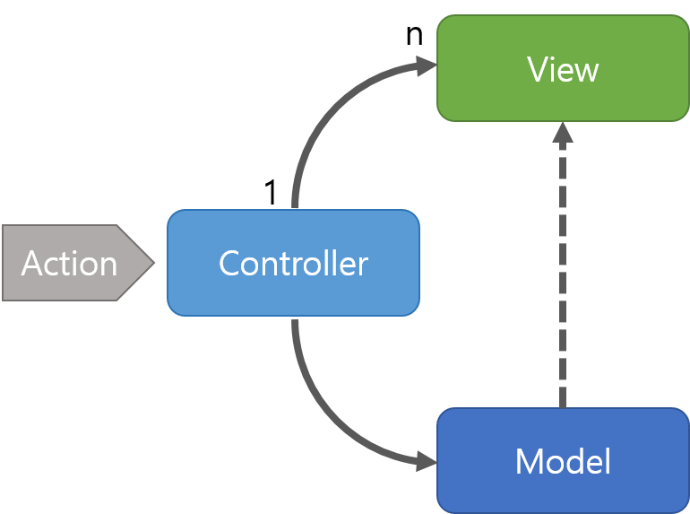
    - 모든 입력은 Controller로 전달되고, Controller는 입력에 해당하는 Model을 업데이트, 업데이트 결과에 따라 View 선택. (Controller는 View를 선택만 할 뿐 직접 업데이트하지 X)
    - View를 업데이트하기 위해서는 View가 Model을 직접 참조하거나, Model에서 View에게 Notify하거나, View가 Polling 방식을 통해 Model의 변화를 감지해야 함 → Model-View 사이의 의존성이 강하다는 문제
    - Controller는 여러 개의 View를 선택해 Model을 나타내줄 수 있음 → View와 Controller는 Many to One 관계
  - **MVP (Model-View-Presenter)**
    > 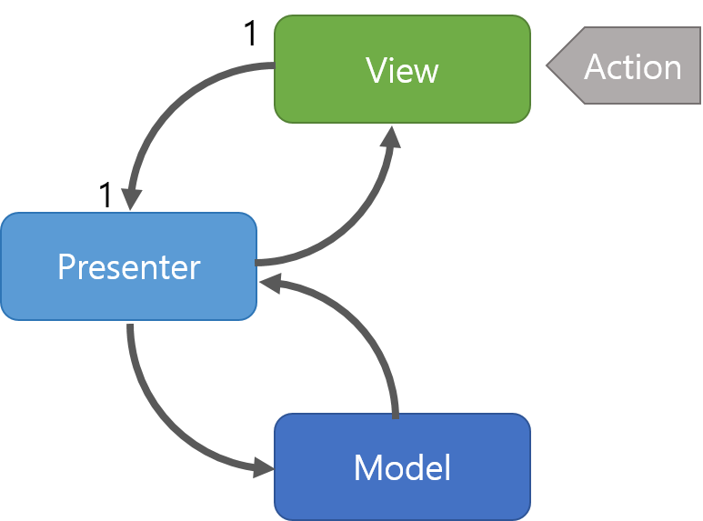
    - Presenter는 View를 통해 사용자 입력을 받고, Model의 도움을 받아 사용자의 데이터를 처리, 그 결과를 View로 다시 전달, View는 전달된 데이터를 통해 화면 갱신
    - Presenter는 인터페이스를 통해 View와 상호작용. 인터페이스는 Presenter 클래스에서 정의됨
    - View는 Presenter만 참조하며, Presenter가 View와 Model 사이를 완전히 중재 → View와 Model의 완전 분리, 하지만 View와 Presenter 사이의 의존성 강해짐
    - MVC보다 단위 테스트가 훨씬 쉬워짐
  - **MVVM (Model-View-ViewModel)**
    > 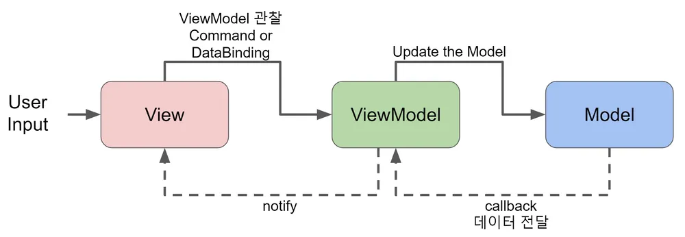
    - 요청 흐름의 제어 주체가 ViewModel
    - Model과 View 사이의 의존성 뿐만 아니라 View와 Controller 사이의 의존성도 고려. 각 요소가 독립적으로 작성되고 테스트 될 수 있도록 설계된 패턴
    - ViewModel은 View를 나타내주기 위한 Model이자, View의 Presentation Logic을 처리하게 됨
      - Presentation Logic : 화면에 어떤 형태로 보여줄지를 결정하는 로직
    - 모든 입력은 View로 전달되고, ViewModel은 입력에 해당되는 Presentation Logic을 처리하여 View에 데이터 전달
    - ViewModel은 View를 참조하지 않고, View와 ViewModel는 Many to One 관계
    - View는 자신이 이용할 ViewModel을 선택해 바인딩하고, 업데이트를 받음
    - Model이 변경되면 해당하는 ViewModel을 이용하는 View가 자동으로 업데이트됨
  - **Layered Architecture**
    - 소프트웨어를 여러 개의 계층으로 분리해 설계하는 방법
    - 계층을 분리해 각 계층 사이의 의존성을 줄여 외부 변화로부터 비즈니스 로직의 변화를 막고, 애플리케이션의 유지보수성과 확장성을 높이려는 목적으로 만들어진 설계 방법 중 하나
    - 구성은 정해져있지 않고, 애플리케이션의 크기나 복잡도, 요구사항 등에 따라 달라짐
    - 계층 간의 의존성이 최소화되어야 하고, 각 계층은 단방향으로 하위 계층의 기능만 사용할 수 있도록 구현해야 함
  - **Hexagonal Architecture**
    > 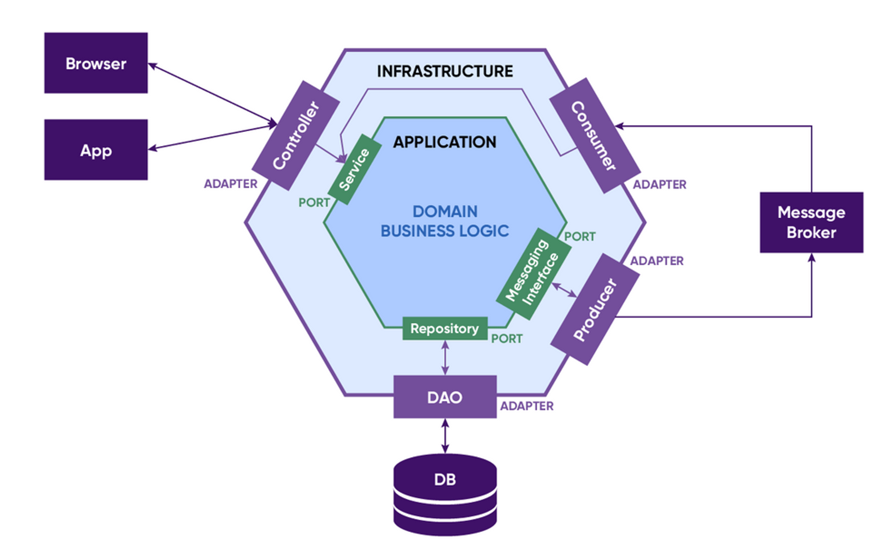
    - 애플리케이션의 핵심 도메인 로직을 외부 환경으로부터 완전히 분리하기 위한 아키텍처
    - Ports and Adapters 아키텍처라고도 불림
      - Port : 도메인이 외부와 상호작용하기 위한 인터페이스. '무엇이 필요하다'만 정의
      - Adapter : Port를 구현하여 실제 기술과 연결
    - UI, DB, 외부 API, 메시지 브로커 등 외부 요소에 도메인이 의존하지 않도록 설계하고, 기술 변경에 강한 구조를 설계하는 것이 목표
    - 모든 의존성은 외부에서 내부 방향으로 향하도록 하고, Domain은 Adapter, Framework, DB를 전혀 몰라야 함
    - 도메인 로직의 순수성이 보장되고, 테스트가 용이하며 기술 교체 비용이 최소화되나 (+),  초기 설계 복잡도가 증가함 (-)
  - **Microservices Architecture**
    - 하나의 시스템을 독립적으로 배포 가능한 여러 서비스로 분리하는 아키텍처
    - 서비스 간 통신은 네트워크를 기반으로 함 (HTTP, gRPC, 메시지 큐 등)
    - 확장성, 독립 배포, 조직 단위 확장과 대규모 시스템에서의 변경 비용 감소가 목표
    - 서비스 간 DB를 공유하지 않고, 데이터 일관성은 이벤트 기반으로 유지해야 함
    - 서비스 단위로 빌드와 배포가 가능하며, API 또는 메시지 기반 통신으로 결합이 느슨함
    - 서비스별 확장, 장애 격리 가능 (+)
    - 분산 시스템 복잡성이 증가하며 네트워크 지연, 장애 처리 필요. 트랜잭션 관리가 어려움

## 9. 디자인 패턴이 무엇인지 설명해주고, 대표적인 디자인 패턴에 대해 설명해 주세요.
- 디자인 패턴이란 개발하면서 발생하는 반복적인 문제들을 어떻게 해결할 것인지에 대한 해결 방안. 다양한 해결책 중 많은 사람들이 인정한 best practice
- `GoF의 디자인패턴`에서는 객체지향 디자인 패턴의 카테고리를 `생성 패턴(Creational Pattern)`, `구조 패턴(Structural Pattern)`, `행동 패턴(Behavioral Pattern)` 3가지로 구분함

#### 생성 패턴 (Creational Pattern)
1. Singleton (싱글톤 패턴) : 하나의 클래스 인스턴스를 전역에서 접근 가능하게 하면서 해당 인스턴스가 한번만 생성되도록 보장하는 패턴
2. Factory Method (팩토리 메서드 패턴) : 객체를 생성하기 위한 인터페이스를 정의하고, 서브클래스에서 어떤 클래스의 인스턴스를 생성할지 결정하는 패턴
3. Abstract Factory (추상 팩토리 패턴) : 관련된 객체들의 집합을 생성하는 인터페이스를 제공하며, 구체적인 팩토리 클래스를 통해 객체 생성을 추상화하는 패턴
4. Builder (빌더 패턴) : 복잡한 객체의 생성 과정을 단순화하고, 객체를 단계적으로 생성하며 구성하는 패턴
5. Prototype (프로토타입 패턴) : 객체를 복제하여 새로운 객체를 생성하는 패턴으로, 기존 객체를 템플리서럼 사용하는 패턴

#### 구조 패턴 (Structural Pattern)
1. Adapter (어댑터 패턴) : 인터페이스 호환성을 제공하지 않는 클래스를 사용하기 위해 래퍼(Wrapper)를 제공하는 패턴
2. Bridge (브릿지 패턴) : 추상화와 구현을 분리하여 두가지를 독립적으로 확장할 수 있는 패턴
3. Composite (컴포지트 패턴) : 개별 객체와 복합 객체를 동이랗게 다루어, 트리 구조의 객체를 구성하는 패턴
4. Decorator (데코레이터 패턴) : 객체에 동적으로 새로운 기능을 추가하여 객체를 확장할 수 있는 패턴
5. Facade (파사드 패턴) : 서브시스템을 더 쉽게 사용할 수 있도록 단순한 인터페이스를 제공하는 패턴
6. Flyweight (플라이웨이트 패턴) : 공유 가능한 객체를 통해 메모리 사용을 최적화하는 패턴
7. Proxy (프록시 패턴) : 다른 객체에 대한 대리자를 제공하여 접근 제어, 지연 로딩 등을 구현하는 패턴

#### 행위 패턴 (Behavioral Pattern)
1. Observer (옵저버 패턴) : 객체 간의 일대다 종속 관계를 정의하여 한 객체의 상태 변경이 다른 객체들에게 알려지도록 함
2. Strategy (전략 패턴) : 

### Singleton의 장단점에 대해 설명해 주세요.
### Singleton이 하나의 객체를 생성한다는 것을 어떻게 보장할 수 있을까요?


## 10. GC에 대해 설명해 주세요.

### 본인이 사용하는 언어에서는 GC를 어떻게 구현했나요?
### GC의 장단점에 대해 설명해 주세요.
### GC는 어떤 영역에 있는 데이터를 관리하나요?
### Reference Counting 방식에 대해 설명하고, 이 알고리즘에서 발생할 수 있는 순환 참조 및 Retain Cycle에 대해 설명해 주세요.


## 11. 32비트와 64비트의 차이는 무엇인가요?

### 32비트에서 가용한 메모리의 크기는 최대 4GB라고 하는데, 왜 그런걸까요?


## 12. 인증과 인가의 차이에 대해 설명해 주세요.

### OAuth가 무엇인지 설명하고, 이것은 인증인지 인가인지에 대해 설명해 주세요.


## 13. JWT 인증 방식이 무엇인가요?

### Signature는 어떻게 만들어지나요?
### 만약 Access Token이 탈취되면, 어떻게 대응할 수 있을까요?
### 반대로 Refresh Token이 탈취되면, 어떻게 대응해야 할까요?


## 14. 암호화 알고리즘에 대해 설명해 주세요.


## 15. 문자열 인코딩에 대해 설명해 주세요.

### Base64 인코딩은 일반적인 문자열 인코딩과는 달리, 사용자가 읽기 어려운 알파벳과 숫자 조합으로 변경합니다. 이를 사용하는 이유는 무엇일까요?

## 16. Git에 대해 설명해 주세요.

### 여러 브랜치를 합쳐야 할 때, 어떤 방법을 사용할 수 있는지 "모두" 설명해 주세요.
### 여러 브랜치를 합쳐야 할 때, 어떤 방법을 사용할 수 있는지 "모두" 설명해 주세요.
